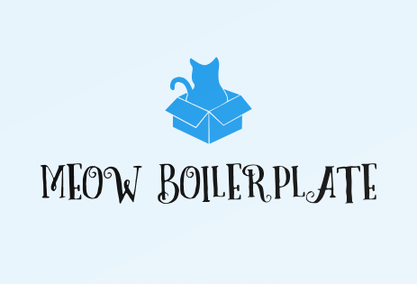

[![NPM version][npm-image]][npm-url]  [![Travis Build Status][travis-image]][travis-url-main]  [![Dependency Status][daviddm-image]][daviddm-url]  [![Coverage Status][coverage-image]][coverage-url]

# MeowBoilerplate

It's just a little Meow Boilerplate for your next Project. Most of the stuff fits for my own requirements and maybe you have the same, you can have a lot of fun with it.

__Give it a try!__

# Table of Contents

-  [Requirments](#requirments)

-  [Getting started](#getting-started)

-  [Commands](#commands)

-  [Built With](#built-with)

-  [Gulp Tasks](#gulp-tasks)

-  [Licensing](#licensing)

-  [Runs with Meow Boilerplate](#runs-with-meow-boilerplate)

## Requirments :pushpin:

-  [NodeJS](https://nodejs.org/en/)

-  [NPM](https://www.npmjs.com/) or [YARN](https://yarnpkg.com/lang/en/)

## Getting started :rocket:

* Install with [npm](https://www.npmjs.com/) or [yarn](https://yarnpkg.com/lang/en/) to get all source files as they are available on Github:

```bash
#Nostalgic
$ npm install meow-boilerplate

#Hipster
$ yarn add meow-boilerplate
```

* Or clone the repo:

```bash
git clone https://github.com/redeagleap/meow-boilerplate.git

cd meow-boilerplate/
```

* And then install NPM-Modules via

```bash
#Nostalgic
$ npm install

#Hipster
$ yarn
```

This install the required __node_modules__.

## Commands :computer:

_With Webpack you have to use NPM Script Commands_

**`npm run init or yarn run init`**<br>

Intialize your Project and the Sass Documentation (/sassdocs/)

**`npm run dev or yarn dev`**<br>

Main development task with BrowserSync and Webpack

**`npm run build or yarn build`**<br>

Minify JS, Images, CSS. Is for a automated Build Process, comes after a Gulp Init.

**`npm run scripts or yarn scripts`**<br>

Rebuild all JS Files except the Application JS File

**`npm run uiimages or yarn uiimages`**<br>

Rebuild all Image Files for CSS, copy it to distribution, build Bitmap- and Vector Sprites.

**`npm run htmlassets or yarn htmlassets`**<br>

Copy all Imagefiles for Documentusage.

**`npm run template or yarn template`**<br>

Copy all or Generate the Template Files.

**`npm run favicon or yarn favicon`**<br>

Generate Favicons and the HTML Snippet (generated Files you will find in `src/.system/`)

## Built With :hammer:

*  [Gulp](https://gulpjs.com/) - Gulp is a toolkit for automating painful or time-consuming tasks in your development workflow

*  [Webpack](https://webpack.js.org/) - Webpack is a bundler for modules.

*  [Sass](https://sass-lang.com/) - Sass is the most mature, stable, and powerful professional grade CSS extension language in the world.

*  [Cypress](https://www.cypress.io/) - Cypress is a fast, easy and reliable testing for anything that runs in a browser.

*  [Babel](https://babeljs.io/) - Babel is a JavaScript compiler.

*  [Astrum](http://astrum.nodividestudio.com/) - Astrum is a lightweight pattern library for any web project.

*  [Sassdoc](http://sassdoc.com/) - Sassdoc is a documentation system to build pretty and powerful docs in the blink of an eye.

## Gulp Tasks :clipboard:

There are some Gulp Tasks there…

```shell
gulp init

gulp watch

gulp browser-sync

gulp default

gulp build

gulp publish

gulp build:bitmapSprite

gulp build:favicon

gulp build:symbolCleanup

gulp build:vectorSprite

gulp combine:js

gulp compiler:css

gulp compiler:html

gulp copy:assets

gulp copy:bitmaps

gulp copy:contentimages

gulp copy:fonts

gulp copy:js

gulp copy:launch

gulp copy:vectors

gulp minify:contentimages

gulp minify:css

gulp minify:inlineimages

gulp minify:js

gulp optimize:criticalCss

gulp rebuild:images

gulp rebuild:js

gulp sassdoc:generate

gulp version:bump
```

## Licensing :beginner:

This project is licensed under the MIT License - see the [LICENSE.md](LICENSE.md) file for details.

## Runs with :yellow_heart: Meow Boilerplate

```txt
Meow Boilerplate made with love & help.

---------------------------------------

Author : Alexander Prisyazhnyuk

Email : insightinyourmind@gmail.com

Github : https://github.com/redeagleap/meow-boilerplate.git
```